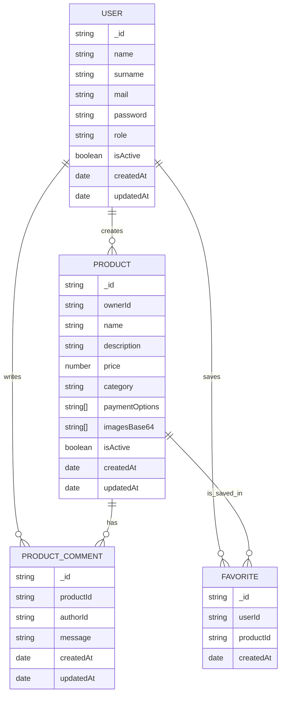

# Diagrama Entidad Relacion

## Objetivo

Este documento muestra el modelo de datos logico del ecommerce.

Aunque la persistencia real sera MongoDB, conviene expresar primero las relaciones como un diagrama entidad-relacion porque ayuda a entender ownership, comentarios y favoritos.

## Entidades

### User

Campos relevantes:

- `_id`
- `name`
- `surname`
- `mail`
- `password`
- `role`
- `isActive`
- `createdAt`
- `updatedAt`

### Product

Campos relevantes:

- `_id`
- `ownerId`
- `name`
- `description`
- `price`
- `category`
- `paymentOptions`
- `imagesBase64`
- `isActive`
- `createdAt`
- `updatedAt`

### ProductComment

Campos relevantes:

- `_id`
- `productId`
- `authorId`
- `message`
- `createdAt`
- `updatedAt`

### Favorite

Campos relevantes:

- `_id`
- `userId`
- `productId`
- `createdAt`

## Relaciones

- Un `User` puede crear muchos `Product`.
- Un `Product` pertenece a un solo `User` creador.
- Un `Product` puede tener muchos `ProductComment`.
- Un `ProductComment` pertenece a un solo `Product`.
- Un `User` puede crear muchos `ProductComment`.
- Un `ProductComment` pertenece a un solo `User` autor.
- Un `User` puede tener muchos `Favorite`.
- Un `Product` puede aparecer en muchos `Favorite`.
- `Favorite` resuelve la relacion muchos-a-muchos entre `User` y `Product`.

## Diagrama ER en texto

```text
User 1 -------- N Product
User 1 -------- N ProductComment
Product 1 ----- N ProductComment
User 1 -------- N Favorite
Product 1 ----- N Favorite
```

## Diagrama ER en Mermaid



## Aclaraciones importantes

### Categorias y opciones de pago

No son entidades.

Se modelan como enums o constantes hardcodeadas en codigo, por eso:

- no tienen tabla o coleccion propia
- no tienen endpoints propios
- no participan como nodos del diagrama ER

### Comentarios

`ProductComment` no tiene relacion consigo misma.

Eso significa:

- no existe `replyTo`
- no existe `parentCommentId`
- no hay arbol de comentarios
- el historial es plano por `productId`

### Favoritos

`Favorite` funciona como entidad puente entre `User` y `Product`.

Regla sugerida:

- indice unico por `userId + productId`

## Traduccion a colecciones MongoDB

### `users`

- guarda usuarios de autenticacion y perfil

### `products`

- guarda productos publicados
- `ownerId` referencia al usuario creador

### `product_comments`

- guarda comentarios de productos
- `productId` referencia al producto
- `authorId` referencia al usuario autor

### `favorites`

- guarda favoritos por usuario
- `userId` referencia al usuario
- `productId` referencia al producto

## Indices recomendados

### `products`

- indice por `ownerId`
- indice por `isActive`
- indice por `category`
- indice por `paymentOptions`

### `product_comments`

- indice por `productId`
- indice por `authorId`
- indice por `createdAt`

### `favorites`

- indice unico compuesto por `userId + productId`
- indice por `userId`
- indice por `productId`

## Vista conceptual final

```text
User
 ├─ creates ──> Product
 ├─ writes ───> ProductComment
 └─ saves ────> Favorite

Product
 ├─ belongs to ─> User
 ├─ has ───────> ProductComment
 └─ appears in -> Favorite
```
