# Key Flows - APIs y Base de Datos

## Objetivo

Este documento describe los flujos principales del ecommerce usando principalmente diagramas Mermaid.

## Convenciones

- `Cliente`: consumidor de la API
- `API`: controllers + services del backend
- `DB`: colecciones MongoDB
- `JWT`: autenticacion requerida

## Vista general

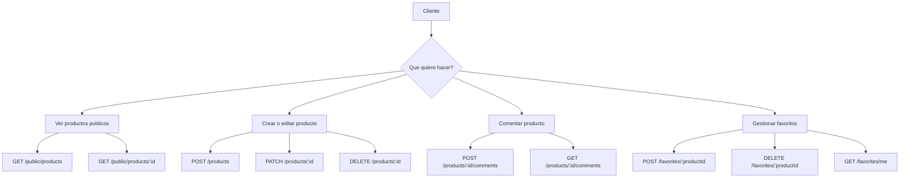

## Flujo 1: Crear producto

- Endpoint: `POST /products`
- Auth: `JWT requerido`
- Escribe en: `products`

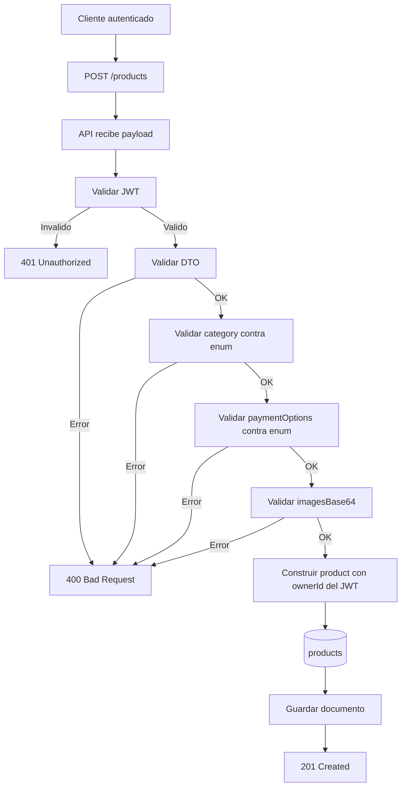

## Flujo 2: Listado publico de productos

- Endpoint: `GET /public/products`
- Auth: `No requerido`
- Lee de: `products`

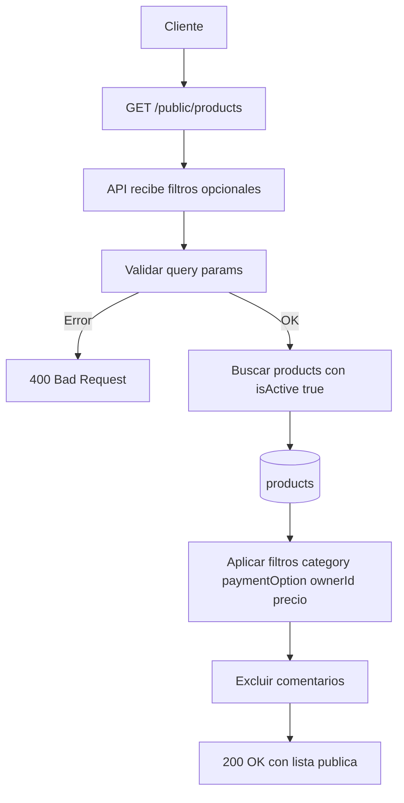

## Flujo 3: Detalle publico de producto

- Endpoint: `GET /public/products/:id`
- Auth: `No requerido`
- Lee de: `products`, `users`

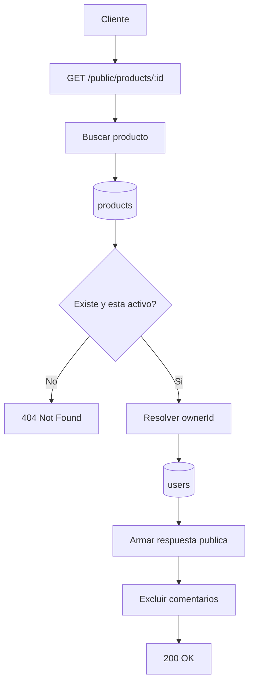

## Flujo 4: Editar o eliminar producto propio

- Endpoints: `PATCH /products/:id`, `DELETE /products/:id`
- Auth: `JWT requerido`
- Lee y escribe en: `products`

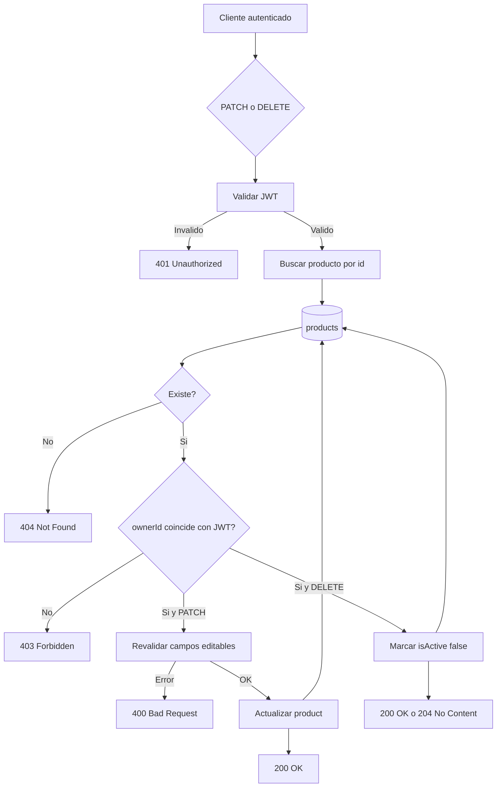

## Flujo 5: Crear comentario en producto

- Endpoint: `POST /products/:id/comments`
- Auth: `JWT requerido`
- Lee de: `products`
- Escribe en: `product_comments`

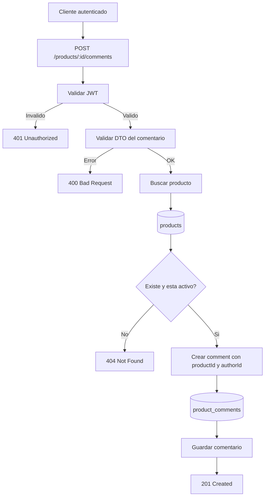

## Flujo 6: Ver comentarios de producto

- Endpoint: `GET /products/:id/comments`
- Auth: `JWT requerido`
- Lee de: `products`, `product_comments`, `users`

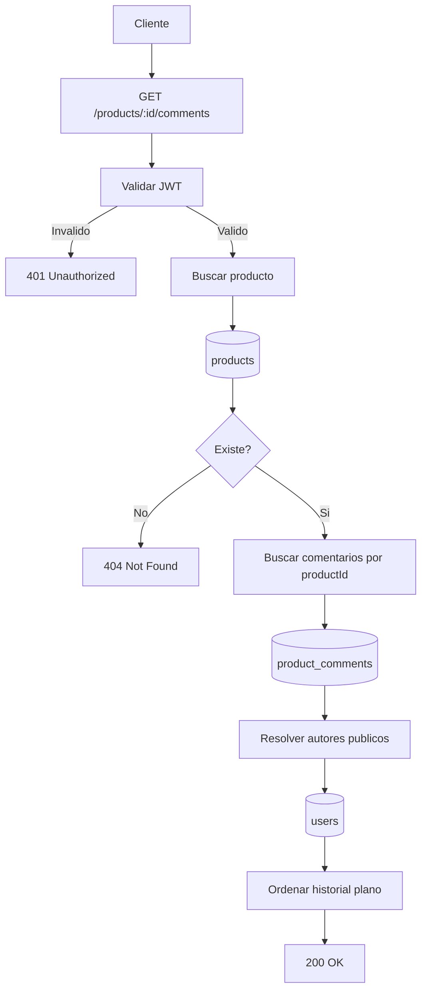

## Flujo 7: Agregar favorito

- Endpoint: `POST /favorites/:productId`
- Auth: `JWT requerido`
- Lee de: `products`, `favorites`
- Escribe en: `favorites`

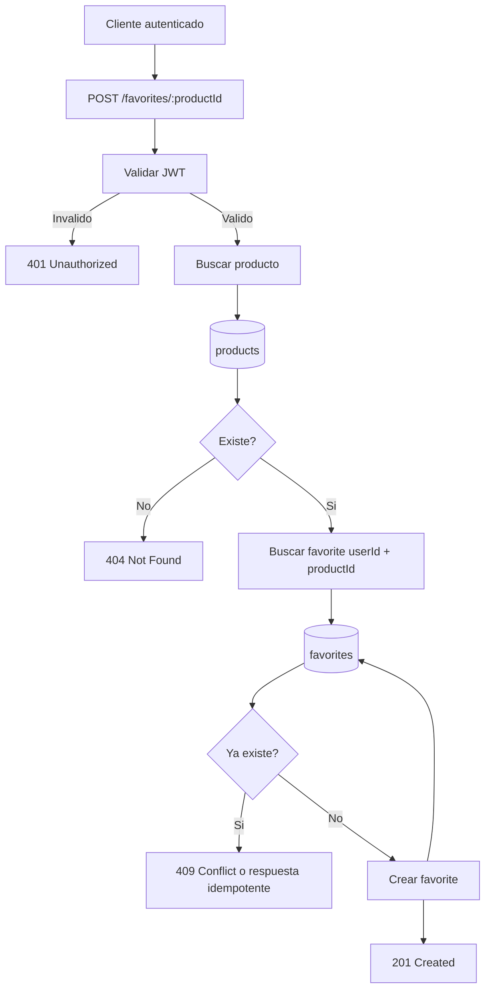

## Flujo 8: Quitar favorito

- Endpoint: `DELETE /favorites/:productId`
- Auth: `JWT requerido`
- Lee y escribe en: `favorites`

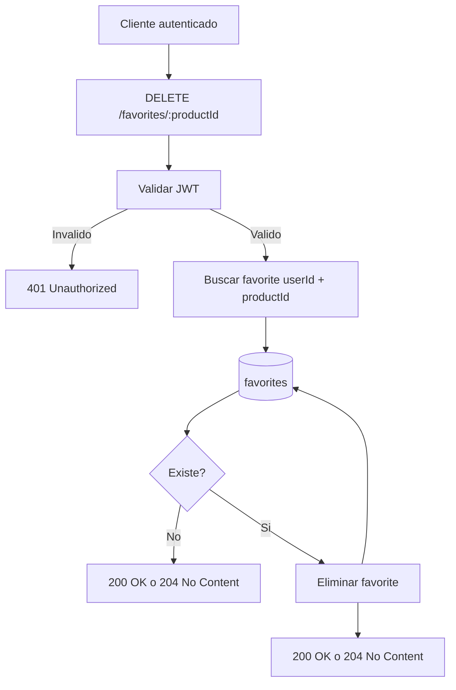

## Flujo 9: Ver mis favoritos

- Endpoint: `GET /favorites/me`
- Auth: `JWT requerido`
- Lee de: `favorites`, `products`

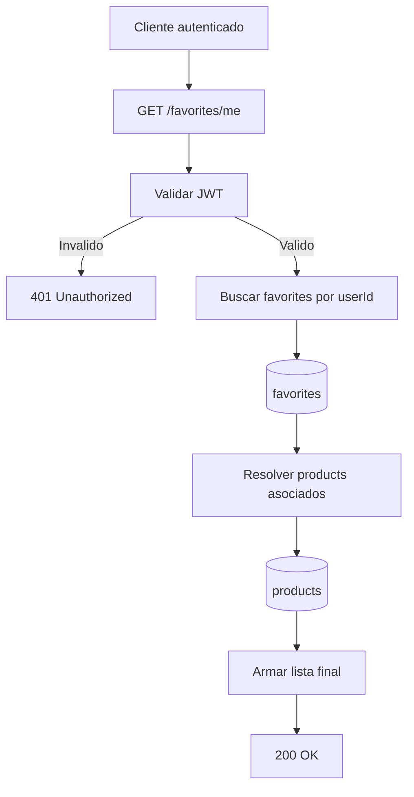

## Resumen de visibilidad

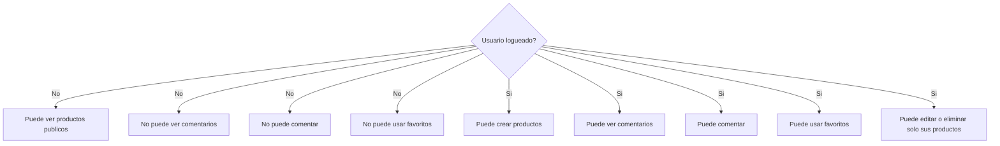
